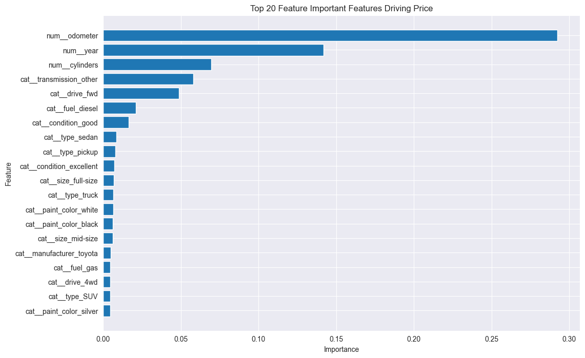
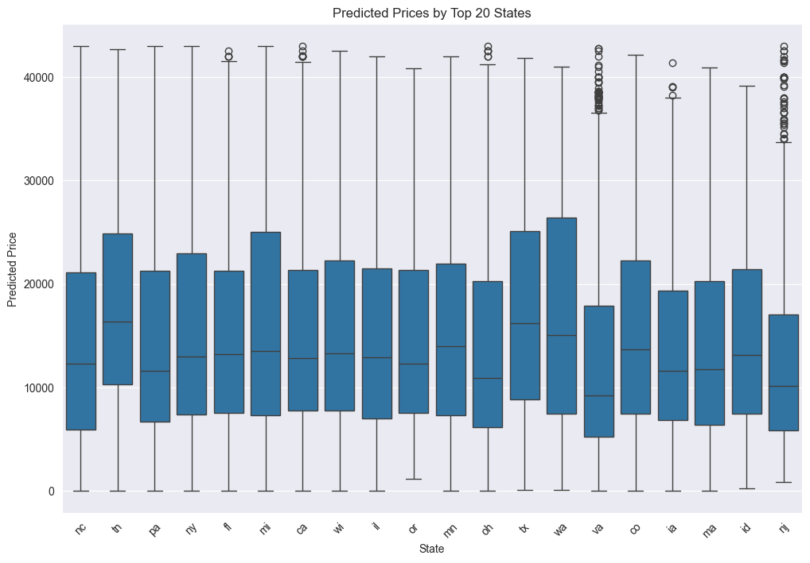
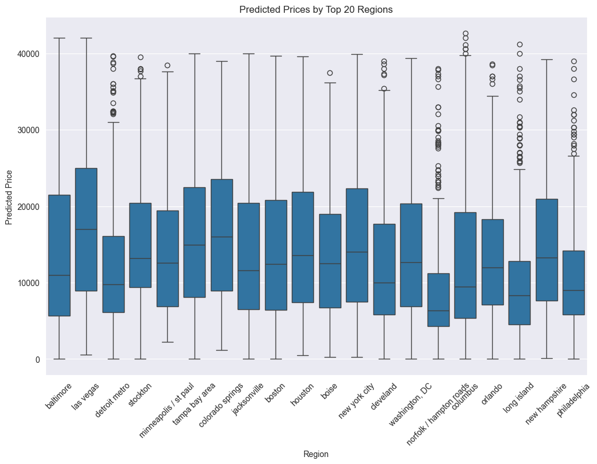
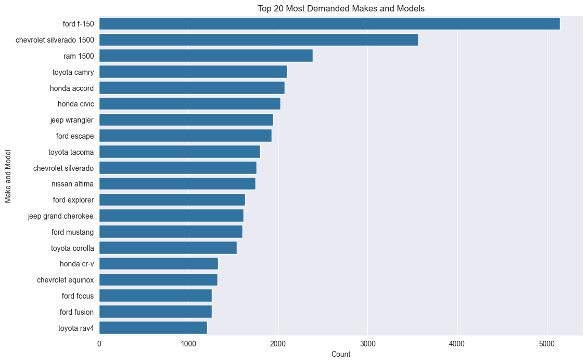

# Used Car Price Analysis: Insights for Optimizing Inventory and Pricing

---

## Introduction
Welcome to our presentation on the key factors influencing used car prices. Our goal is to provide actionable insights to help you, as used car dealers, optimize your inventory and pricing strategies. We'll cover feature importance, geographic influence, and market demand.

---

## Feature Importance

Using a Bagging Regressor model, we identified the top 20 features that significantly impact used car prices.

**Key Features:**
- **Odometer Reading**: Higher mileage generally lowers the car's price.
- **Year**: Newer models tend to have higher prices.
- **Number of Cylinders**: Engine size and performance affect the car's value.
- **Transmission Type**: Automatic or manual transmissions influence car prices differently.
- **Drive Type**: Cars with different drive types (FWD, AWD, etc.) have varying market values.
- **Fuel Type**: Diesel vehicles often have different market values compared to gasoline vehicles.
- **Condition**: The car's condition (e.g., good, excellent) significantly impacts its price.
- **Car Type**: Different types of vehicles (sedans, pickups, SUVs) have different price ranges.

**Business Implications:**
- **Pricing Strategy**: Use these key features to set competitive and profitable prices.
- **Inventory Management**: Focus on acquiring vehicles with desirable features (e.g., low mileage, newer models).

---

## Geographic Influence

Geographic factors play a crucial role in determining used car prices. We analyzed the impact of geographic location on predicted car prices.

**Predicted Prices by State:**
- **Higher Median Prices**: States like California (CA), Florida (FL), and New York (NY) indicate higher market values.
- **Lower Median Prices**: States like North Carolina (NC), Tennessee (TN), and Pennsylvania (PA) suggest more affordable car markets.
- **Price Variation**: States with longer IQRs, like Texas (TX) and Ohio (OH), indicate a wider range of car prices.

**Predicted Prices by Region:**
- **Higher Median Prices**: Regions like New York City, Las Vegas, and Houston reflect higher market values.
- **Lower Median Prices**: Regions such as Stockton and Cleveland indicate more affordable car markets.
- **Price Spread**: Regions with larger spreads, such as Philadelphia and Boston, indicate diverse pricing within those markets.

**Business Implications:**
- **Regional Pricing Strategy**: Adjust prices based on regional market values.
- **Inventory Allocation**: Allocate inventory strategically to regions with higher market values.

---

## Market Demand Analysis

We analyzed market demand by evaluating the average price and count of different makes and models.

**Top 20 Most Demanded Makes and Models:**
- **Ford F-150**
- **Chevrolet Silverado 1500**
- **Ram 1500**
- **Toyota Camry**
- **Honda Accord**

These models have the highest counts, indicating strong demand in the market.

**Business Implications:**
- **Inventory Focus**: Prioritize stocking high-demand makes and models to ensure fast turnover and profitability.
- **Sales Strategy**: Develop targeted promotions for popular models.

---

## Key Takeaways

1. **Pricing Strategy**:
    - Higher median prices in states like CA, FL, and NY suggest that dealerships in these areas can price cars more aggressively.
    - More affordable markets like NC, TN, and PA require competitive pricing to attract buyers.

2. **Inventory Management**:
    - High variability and outliers in regions like NY and CA suggest a demand for luxury or high-demand vehicles. Stock a diverse range of vehicles, including high-end models, in these areas.
    - Affordable markets benefit from a mix of budget-friendly and mid-range vehicles.

3. **Market Positioning**:
    - Regional specialization allows dealerships to tailor their marketing and sales strategies. For example, promoting luxury vehicles in high-value markets and budget-friendly options in more affordable regions.

4. **Sales Strategy**:
    - Customized promotions and discounts can be tailored based on regional pricing insights. Offering financing options in high-value markets can attract customers interested in higher-end models.
    - Analyzing seasonal trends in different regions helps in dynamic pricing strategies to maximize sales during peak times.

---

## Conclusion

By leveraging these insights, you can optimize your inventory, set competitive prices, and tailor your sales strategies to different markets. This will enhance profitability and customer satisfaction, helping you stay ahead in the competitive used car market.

Thank you for your attention. We are open to any questions you might have.
